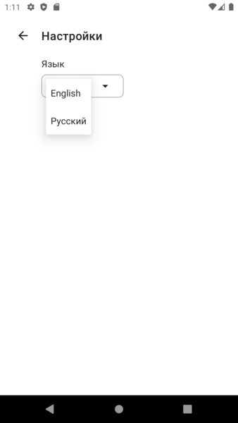

# CardNotes
Application for managing notes.

# Features:
* Save you thoughts in fast and easy way.
* Organize your notes in different folders.
* Delete and move existing notes by selecting them from the list. No need to do this with each note separately!

# Grid of notes
Here you can see all your notes

# List of notes
You can change the way the notes are displayed

# Changing Language 
You can change language in the settings. 
Currently available languages are:
* Russian
* English

# Create note
And here is the screen where you can write your note!

